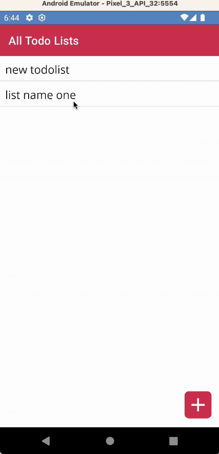

# MauiTodo

## todo
[Project planning](MauiTodo%20plan.md) *wish i had a todolist for this...*

## what
a little dotnet MAUI todolist app with 
- unit tests
- shell navigation
- font icons
- dark & light theme
- simple plaintext json persistence: in the future IDataProvider impl can be replaced with another strategy (sqlite+rest+caching)

|  | |
| -- | -- |
| | |
| | |
| | |

